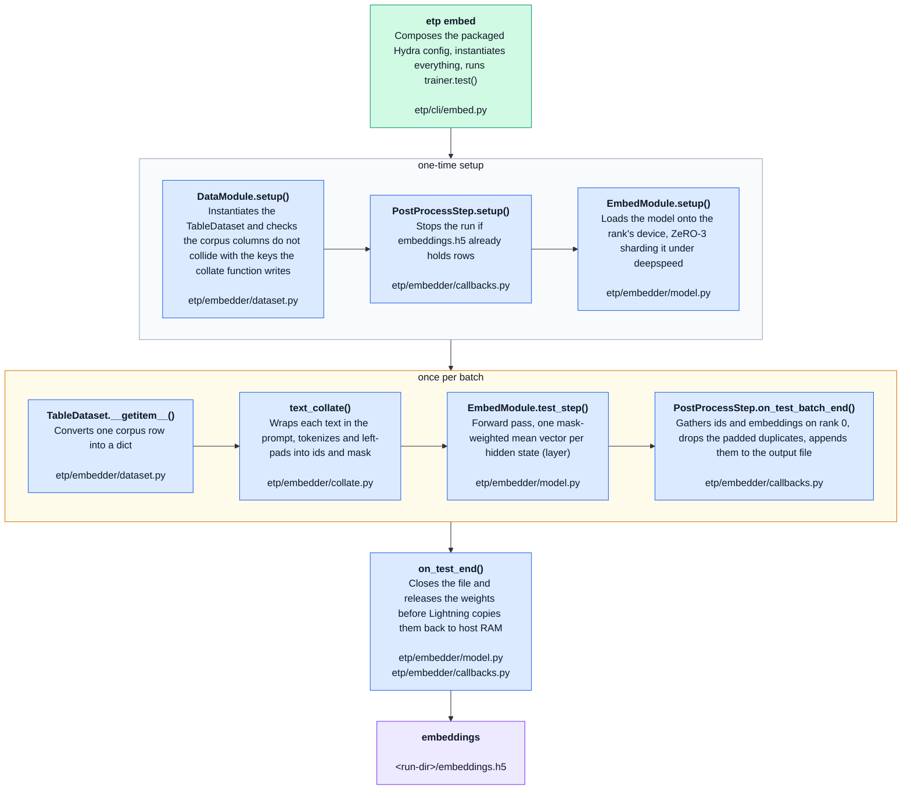
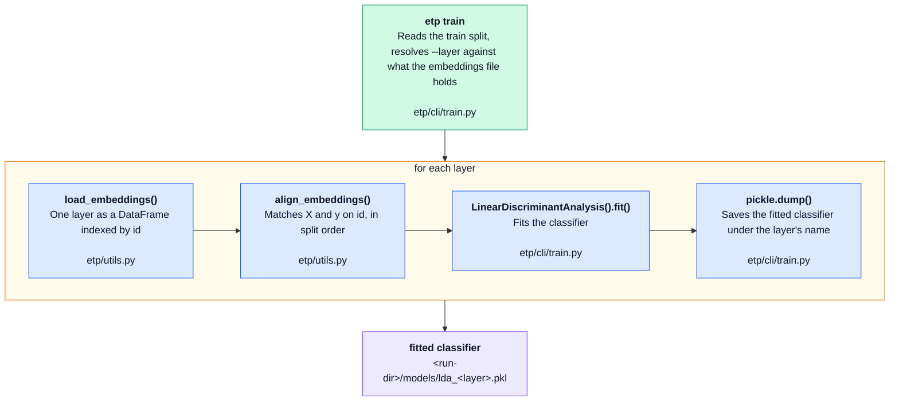
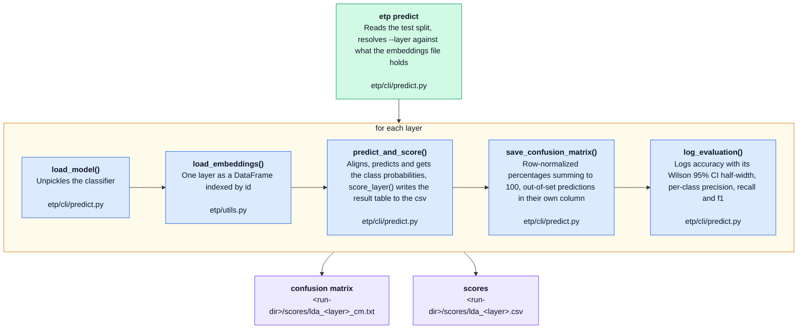

# Pipeline

Three phases, each a subcommand of `etp`: phase 1 (`embed`) writes one `embeddings.h5` for the whole corpus, phase 2 (`train`) fits a linear classifier on it and phase 3 (`predict`) evaluates that classifier. The run folder is the unit that matters, set with `run_directory=` in phase 1 and with `--run-dir` in phases 2 and 3, both pointing at the same folder.

Phase 1 is built on PyTorch Lightning, phases 2 and 3 are plain Python. The diagrams show the functions called in execution order, each labeled with the file it lives in.

🟩 entry point 🟦 pipeline step 🟧 loop ⬜ one-time block 🟪 disk

## 1. embed

Lightning is organized around two objects: the `DataModule` says how the data is loaded and batched, the `EmbedModule` what is computed on each batch. The `PostProcessStep` callback covers everything that happens around the batches: it makes sure the output file is free before any weight is loaded, it collects the embeddings on rank 0 after each batch, and it closes the file when the loop ends. The strategy decides how the model is spread over the hardware, `ddp` replicating it and `deepspeed` sharding it with ZeRO-3.

## 2. train

One linear discriminant analysis per layer, fitted on the train split. `--layer` takes a layer index for one layer, `last` for the deepest layer stored, `all` for every layer in the file.

## 3. predict

Loads one classifier per layer and evaluates it on the test split. Nothing is fitted here, `etp predict` loads only what `etp train` wrote under `<run-dir>/models/`.

